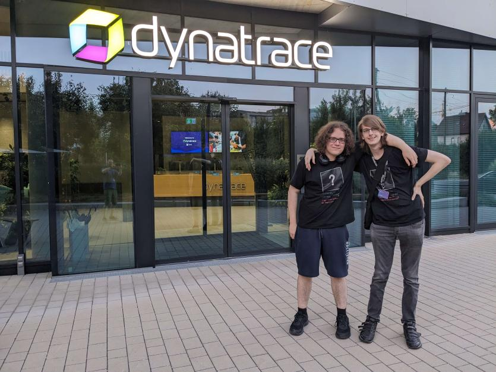

# Rust Meetup Linz #32

| Info |  |
| --- | --- |
| Topic | Quick orientation for C++ developers looking to try Rust |
| Location | Dynatrace HQ, Linz, Austria |
| Date (DMY) | 23.08.2023 |
| VOD | [VOD](https://youtu.be/krtZGDewYpo) |
| Co-speakers | None |
| Event page | [meetup.com](https://www.meetup.com/rust-linz/events/294718621)  |
| Slides | [Slides](slides.pdf) |
| Blog Post | [Blog Post](https://unknowntrojan.win/2023/08/24/rustlinz/) |

## Rust learning resources

I have provided some resources on learning Rust [here](/RUST.md).

## Pictures

Left: one of my friends, Right: me
